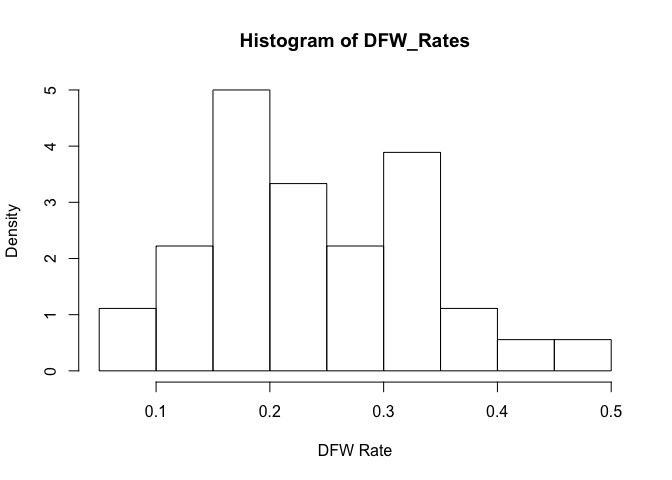
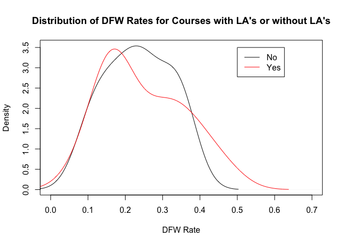
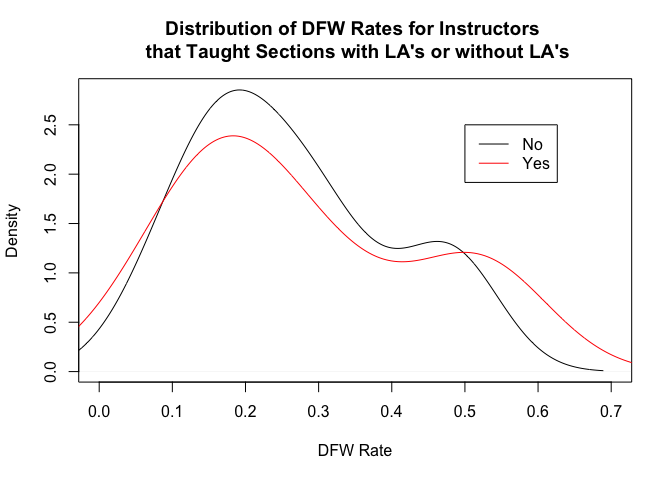
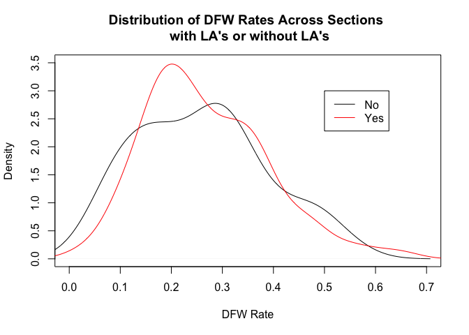

LA Program
================
Galen I Papkov & Blake Gilliland

# Exploratory Data Analysis

| LA  | Course                       | DFW.Count | DFW.Rate |
| :-- | :--------------------------- | --------: | -------: |
| No  | Calculus I                   |       124 |     0.33 |
| Yes | Calculus I                   |        39 |     0.28 |
| No  | Calculus II                  |        26 |     0.20 |
| Yes | Calculus II                  |        12 |     0.34 |
| No  | College Algebra              |       784 |     0.28 |
| Yes | College Algebra              |        88 |     0.31 |
| No  | College Physics w/Lab II     |         5 |     0.16 |
| Yes | College Physics w/Lab II     |         5 |     0.16 |
| No  | Elementary Calculus          |        76 |     0.35 |
| Yes | Elementary Calculus          |        50 |     0.47 |
| No  | Engineering Mechanics        |        14 |     0.27 |
| Yes | Engineering Mechanics        |         6 |     0.16 |
| No  | Finite Mathematics           |        23 |     0.11 |
| Yes | Finite Mathematics           |        18 |     0.17 |
| No  | Gen’l Biology w/Lab I        |       477 |     0.34 |
| Yes | Gen’l Biology w/Lab I        |        40 |     0.35 |
| No  | General Chemistry I          |       682 |     0.37 |
| Yes | General Chemistry I          |       178 |     0.39 |
| No  | General Chemistry II         |       138 |     0.33 |
| Yes | General Chemistry II         |       152 |     0.41 |
| No  | Intermediate Algebra         |       464 |     0.22 |
| Yes | Intermediate Algebra         |        62 |     0.29 |
| No  | Intro Earth Science          |        47 |     0.15 |
| Yes | Intro Earth Science          |        22 |     0.16 |
| No  | Intro to Computer Science    |        36 |     0.22 |
| Yes | Intro to Computer Science    |        31 |     0.17 |
| No  | Intro. Environmental Science |        13 |     0.09 |
| Yes | Intro. Environmental Science |         3 |     0.08 |
| No  | Introduction to Programming  |         6 |     0.12 |
| Yes | Introduction to Programming  |        21 |     0.13 |
| No  | Precalculus                  |       211 |     0.25 |
| Yes | Precalculus                  |        53 |     0.22 |
| No  | Social Science Statistics    |        12 |     0.18 |
| Yes | Social Science Statistics    |         5 |     0.16 |
| No  | Statistical Methods          |       674 |     0.25 |
| Yes | Statistical Methods          |        23 |     0.21 |

## Paired T-test for DFW Rate, pairing by Course. Looking for an LA Effect.

    ## 
    ##  Paired t-test
    ## 
    ## data:  LA_DFW and NonLA_DFW
    ## t = 0.8984, df = 17, p-value = 0.1908
    ## alternative hypothesis: true difference in means is greater than 0
    ## 95 percent confidence interval:
    ##  -0.01248453         Inf
    ## sample estimates:
    ## mean of the differences 
    ##              0.01333333

<!-- -->

    ## The following objects are masked from dat:
    ## 
    ##     Avg..DF.RATE, Avg..DFW.RATE, Avg..W.RATE, Course, Course.Name, CRN,
    ##     DF.Number, DFW, DFW.Cate, Historical.DFW, LA, Students, Term,
    ##     W.Number

    ## 
    ##  Shapiro-Wilk normality test
    ## 
    ## data:  pair_dat$Avg..DFW.RATE
    ## W = 0.90929, p-value = 0.01428

    ## 
    ##  Shapiro-Wilk normality test
    ## 
    ## data:  pair_dat$Avg..DFW.RATE[pair_dat$LA == "Yes"]
    ## W = 0.91312, p-value = 0.1512

    ## 
    ##  Shapiro-Wilk normality test
    ## 
    ## data:  pair_dat$Avg..DFW.RATE[pair_dat$LA == "No"]
    ## W = 0.899, p-value = 0.0919

    ## 
    ##  Wilcoxon signed rank test with continuity correction
    ## 
    ## data:  Instruct_LA and Instruct_No_LA
    ## V = 36, p-value = 0.4118
    ## alternative hypothesis: true location shift is greater than 0

<!-- -->

<!-- -->

<!-- -->

    ##     Group.1     Group.2          x
    ## 1  BSC1010C   Fall 2016 0.35571429
    ## 2  CHM1045    Fall 2016 0.35500000
    ## 3  COP2006    Fall 2016 0.06500000
    ## 4  MAC1105    Fall 2016 0.28812500
    ## 5  MAT1033    Fall 2016 0.20882353
    ## 6  MGF1106    Fall 2016 0.10666667
    ## 7  STA2023    Fall 2016 0.23357143
    ## 8  CHM1045    Fall 2017 0.33571429
    ## 9  COP1500    Fall 2017 0.25000000
    ## 10 ESC1000C   Fall 2017 0.18000000
    ## 11 MAC1105    Fall 2017 0.29866667
    ## 12 MAC1147    Fall 2017 0.26454545
    ## 13 MAC2311    Fall 2017 0.33500000
    ## 14 MAT1033    Fall 2017 0.24529412
    ## 15 CHM1045    Fall 2018 0.41000000
    ## 16 CHM1046    Fall 2018 0.43333333
    ## 17 COP1500    Fall 2018 0.15000000
    ## 18 COP2006    Fall 2018 0.17000000
    ## 19 EVR1001C   Fall 2018 0.08666667
    ## 20 MAC2312    Fall 2018 0.23200000
    ## 21 STA2122    Fall 2018 0.17666667
    ## 22 BSC1010C Spring 2017 0.34375000
    ## 23 CHM1046  Spring 2017 0.34000000
    ## 24 COP1500  Spring 2017 0.19000000
    ## 25 COP2006  Spring 2017 0.07000000
    ## 26 MAC1105  Spring 2017 0.27125000
    ## 27 MAC1147  Spring 2017 0.22000000
    ## 28 MAC2233  Spring 2017 0.38833333
    ## 29 PHY2054C Spring 2017 0.16000000
    ## 30 CHM1045  Spring 2018 0.40200000
    ## 31 CHM1046  Spring 2018 0.31000000
    ## 32 COP1500  Spring 2018 0.19000000
    ## 33 COP2006  Spring 2018 0.17000000
    ## 34 EGM3420C Spring 2018 0.22666667
    ## 35 ESC1000C Spring 2018 0.12500000
    ## 36 MAC1147  Spring 2018 0.23600000
    ## 37 MAC2311  Spring 2018 0.30428571
    ## 38 MGF1106  Spring 2018 0.17666667
    ## 39 STA2023  Spring 2018 0.27230769
